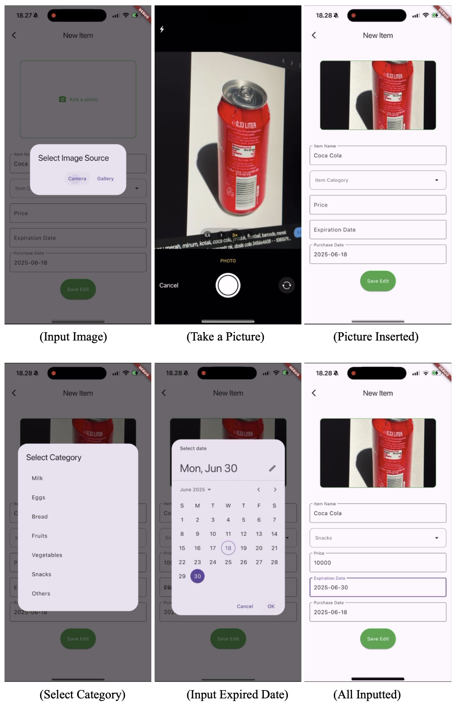
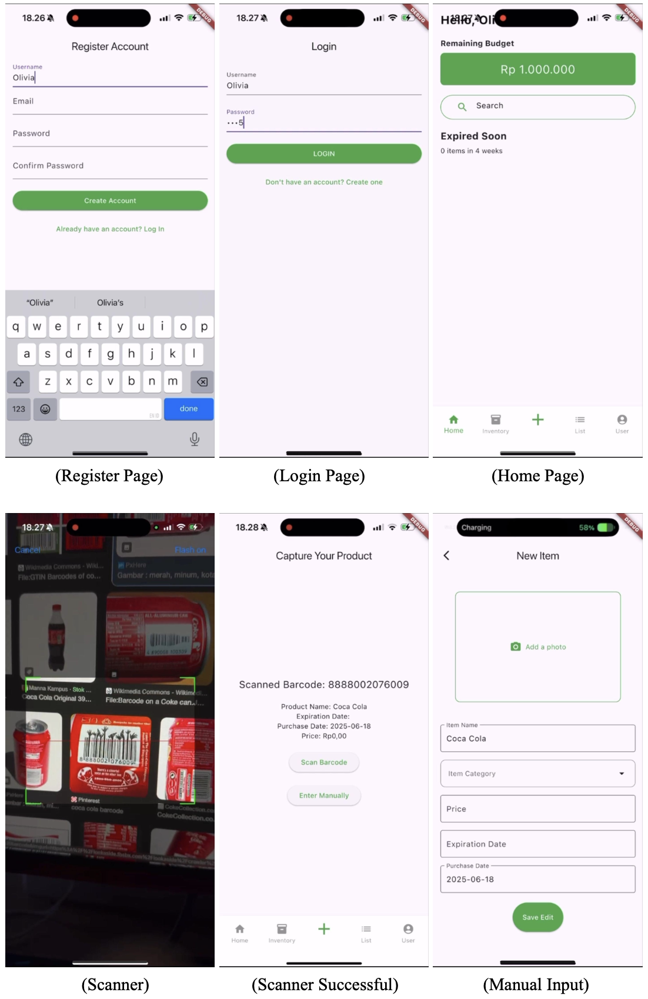
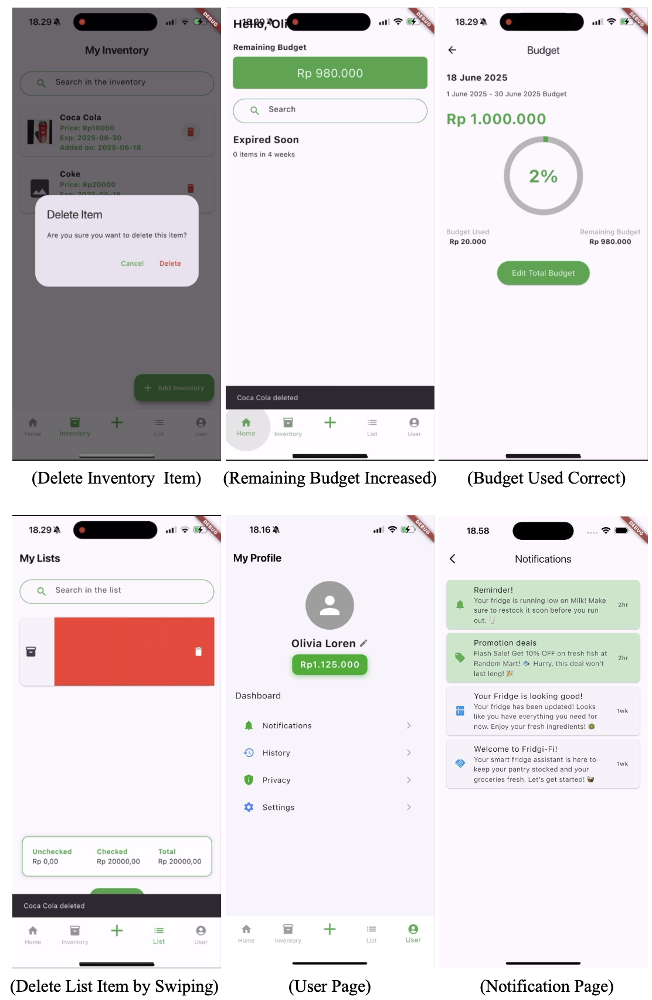
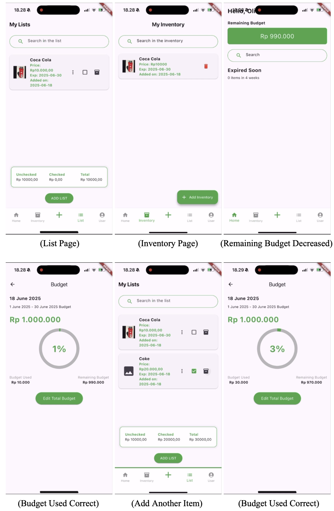

# FRIDGIFI - Smart Pantry Tracking Application

> ⚠️ Note: This project is demo-ready. The app is built with Flutter and Dart.

[](https://flutter.dev/)
[](https://dart.dev/)
[](https://opensource.org/licenses/MIT)

---


FRIDGIFI is an AI-powered smart pantry tracking application designed to help users manage their pantry inventory, reduce food waste, and track expenses. It acts as a personalized shopping assistant, providing reminders and recommendations based on available groceries, expiration dates, and spending habits.

---

## 📖 Background

Many users struggle with tracking groceries, avoiding duplicate purchases, and managing monthly food budgets. Through a survey of 40 participants, we found that an average of 73% often forget what they have at home, overspend, or buy unnecessary items. FRIDGIFI addresses these problems by providing automated reminders, AI-based image recognition for pantry items, and smart notifications to manage inventory effectively.

---

## 🚀 Features

- **Smart Pantry Tracking:** Scan food items with the camera to maintain a digital inventory and track expiration dates.  
- **Shopping List Management:** Automatically generate a dynamic shopping list and provide reminders only when items need restocking.  
- **Budget-Friendly Suggestions:** Analyze spending habits and suggest budget-friendly options and discounts.  
- **Notifications & Alerts:** Alerts for items running low or nearing expiration.  
- **User Profile Management:** Edit profile, track expenses, and manage pantry inventory efficiently.  

---

## 🛠️ Tech Stack

- **Flutter & Dart** – Frontend and app logic  
- **AI / ML Models** – For image recognition and inventory suggestions  
- **Local Storage / Database** – Store pantry data and user preferences  

---

## 💻 Getting Started

Clone the repository:

```bash
git clone [https://github.com/YOUR_USERNAME/fridgifi.git](https://github.com/YOUR_USERNAME/fridgifi.git)
cd fridgifi
````

Install dependencies:

```bash
flutter pub get
```

Run the app on your device/emulator:

```bash
flutter run
```

-----

## 🏆 Credits

**Project Team:**

  * Emily Wilkinson
  * Vennycia Susanto
  * Olivia Putri
  * Jessica Alhena Joprang
  * Liona Loren

-----

## 🖼️ App Preview

**Figma Prototype:** [View on Figma](https://www.figma.com/design/sWaq8OAKMYFp3oNssT4b5A/Fridgi-Fi?node-id=0-1&t=UF2d7MlT3KONevxi-1)





*Preview of the FRIDGIFI application interface.*

---

## 📜 License

This project is licensed under the MIT License. You can use, copy, modify, and distribute the code freely, but you must include the same license in derivative works.

-----

## ⚡ Notes

The project is demo-ready but is not an official release. Data and AI models are for demonstration purposes only. All contributors are acknowledged in the Credits section.

